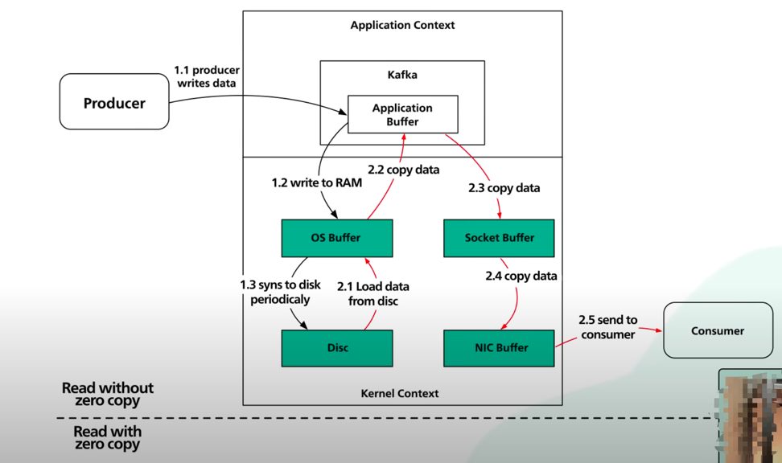

# Why is Kafka Fast?

## Understanding Performance Metrics

### 1. Latency
- **Definition**: Time duration required to complete an operation (e.g., message delivery)
- **Focus**: Associated with **individual user experience**
- **When to optimize**: When a single user experiences slowness
- **Measurement**: Time units (ms, seconds)

### 2. Throughput
- **Definition**: Number of operations completed per unit time
- **Focus**: **Scalability** perspective - how many clients can be served simultaneously
- **When to optimize**: When struggling with multiple concurrent users
- **Measurement**: Operations/second or requests/second

### Key Differences
- **Latency optimization**: Focuses on completion time of individual operations
- **Throughput optimization**: Focuses on overall processing capacity of the system
- **Relationship**: Reducing latency may improve throughput (200ms → 100ms: 5 → 10 ops/s)
- **Independent improvement**: Throughput can be improved without reducing latency (increasing threads: 1 → 10 threads, 5 → 50 ops/s)

---

## Sequential I/O: The Foundation of Kafka's Performance

### Common Misconception
There is a common misconception that disk access is always slower than memory access. However, performance largely depends on the **access pattern** (sequential vs. random).

### Random I/O vs Sequential I/O

**Random I/O:**
- Requires physical movement of disk arm to different positions on magnetic disks
- High seek time overhead
- Poor performance due to mechanical limitations

**Sequential I/O:**
- Reads or writes data in order, one block after another
- Minimal seek time
- Much faster than random I/O

### Kafka's Advantage
Kafka leverages sequential I/O by using an **append-only log** as its primary data structure. This design choice provides several benefits:

- **Predictable performance**: Consistent read/write speeds
- **Cost-effective storage**: HDDs perform well for sequential access
- **Simplified architecture**: No complex indexing required for writes

> **Performance Impact**: Sequential I/O is several orders of magnitude faster than random I/O.

### Storage Cost Benefits
For Kafka, using hard disk drives (HDDs) is cost-effective. Due to sequential I/O patterns, the performance gap between HDDs and SSDs is not as significant as in random access scenarios.

---

## Zero Copy: Eliminating Unnecessary Data Movement

### The Problem
Kafka needs to transfer large amounts of data from disk to network and vice versa. Traditional approaches involve multiple data copies, which is inefficient.

### The Solution: Zero Copy
Modern Unix systems are highly optimized to transfer data from disk to network without excessive copying. This technology is called **Zero Copy**.

### How Zero Copy Works

1. **Traditional approach**: Disk → Kernel Buffer → User Buffer → Socket Buffer → Network  
  4 Copies and 2 System calls

2. **Zero Copy approach**: Disk → Kernel Buffer → Network (direct transfer)

### Benefits
- **Reduced CPU usage**: Less data copying means less CPU overhead
- **Lower memory usage**: Fewer buffer allocations
- **Higher throughput**: More efficient data transfer
- **Reduced latency**: Faster data processing

### Implementation Methods
- **sendfile()**: Direct file-to-socket transfer
- **mmap()**: Memory-mapped files
- **DMA (Direct Memory Access)**: Hardware-assisted transfers

---

## Additional Performance Optimizations

### 1. Batching
- Group multiple messages together
- Reduce per-message overhead
- Improve network efficiency

### 2. Compression
- Reduce network bandwidth usage
- Faster data transfer
- Lower storage requirements

### 3. Partitioning
- Parallel processing across multiple partitions
- Better resource utilization
- Improved scalability

### 4. Producer/Consumer Optimization
- **Producer**: Async sends, batching, compression
- **Consumer**: Efficient polling, proper offset management

---

## Performance Comparison

| Aspect | Traditional Message Queue | Kafka |
|--------|---------------------------|-------|
| **I/O Pattern** | Random access | Sequential access |
| **Data Copy** | Multiple copies | Zero copy |
| **Storage** | Memory-based | Disk-based |
| **Scalability** | Limited | High |
| **Durability** | Limited | High |

---

## Reference
- 